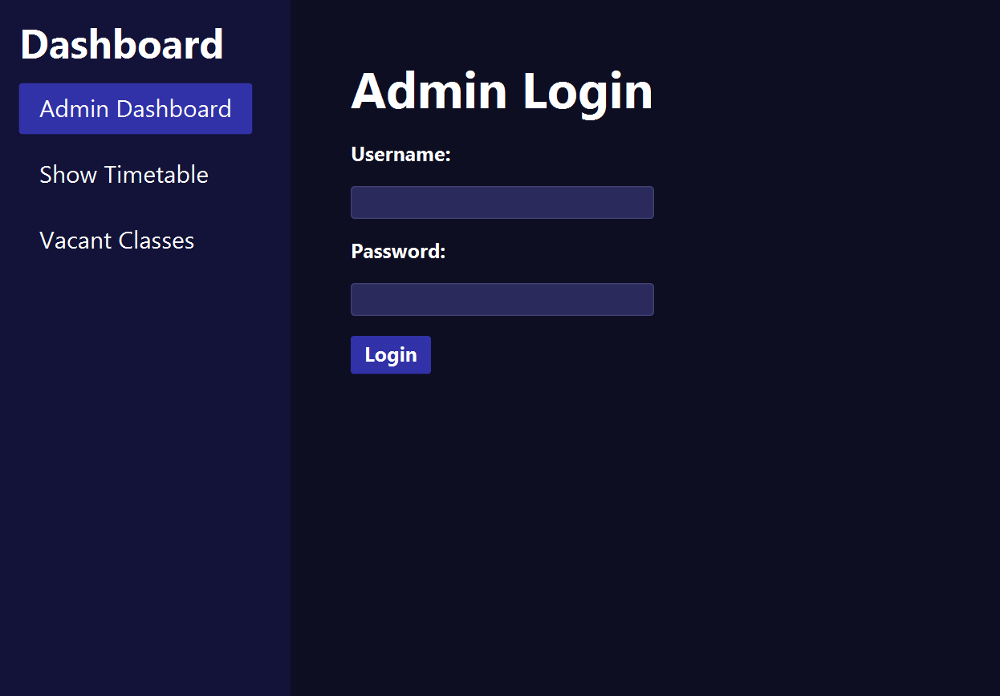
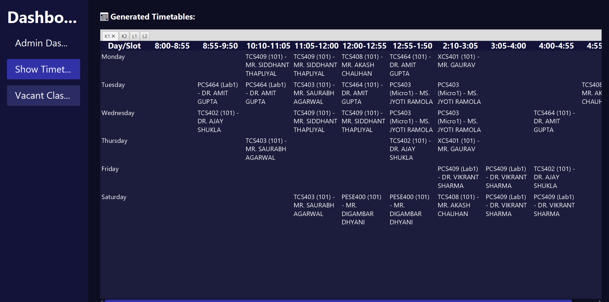
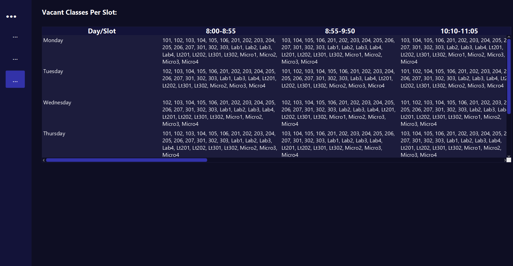

# 🗓️ Timetable Scheduler

A desktop application to automatically generate class timetables and analyze vacant classrooms using a hybrid architecture:

- **JavaFX (Java)** for the user-friendly graphical interface  
- **Python** for the backend timetable generation logic  

The system takes an Excel file as input (with details of subjects, faculties, rooms, labs, etc.), then uses an algorithm to generate conflict-free timetables and vacant room reports in CSV format.

---

## ✨ Features

- 🔐 **Admin Login Interface**  
- 📤 **Upload Excel Configuration File**  
- 🧠 **Automatic Timetable Generation** using Python  
- 📅 **View Timetables by Section** in an interactive tab view  
- 🏫 **Vacant Classrooms Report** generation  
- 📁 **Downloadable Sample Excel Template**  

---

## 🎯 Use Case

Designed for **educational institutions** (schools, colleges, universities) to:

- Reduce manual workload of scheduling  
- Avoid faculty or room clashes  
- Track room availability per time slot  

---

## 📂 Folder Structure

```
project-root/
├── TimetableGUI.java                # JavaFX GUI
├── generate_timetable.py           # Python logic
├── demo.xlsx                       # Sample Excel input template
├── timetable_<section>.csv         # Output per section
├── vacant_classes_all_sections.csv # Vacant room report
├── style.css                       # GUI styling
└── README.md
```

---

## 🛠️ Technologies Used

| Component         | Tech Stack           |
|------------------|----------------------|
| GUI              | JavaFX               |
| Backend Logic    | Python 3.8+          |
| Data Processing  | `pandas`, `openpyxl` |
| File Formats     | Excel (input), CSV (output) |

---

## 🧪 Input File Format (Excel)

The application requires an Excel file (`.xlsx`) with the following **sheets**:

| Sheet Name        | Description |
|------------------|-------------|
| `Sections`       | List of all class sections (e.g. K1, K2) |
| `Slots`          | Time slot IDs and ranges |
| `Days`           | Day IDs and names (e.g. 1 = Monday) |
| `Rooms`          | Room IDs and names |
| `CS_Labs`        | Computer lab room names |
| `Micro_Labs`     | Microprocessor lab room names |
| `Subjects_Weekly`| Subject name, required weekly count, and units per session |
| `Faculty_Map`    | Subject-to-faculty assignment |

📄 A sample template (`demo.xlsx`) is provided.

---

## 🚀 How to Run

### Prerequisites

- **Java 17+**
- **JavaFX SDK**
- **Python 3.8+**
- Python packages:
  ```bash
  pip install pandas openpyxl numpy
  ```

### Steps

1. **Open the JavaFX GUI**  
   Compile and run `TimetableGUI.java`.

2. **Login:**  
   - Username: `admin`  
   - Password: `admin`  

3. **Upload Excel File**  
   Use the GUI to browse and select your configuration file (.xlsx).

4. **Generate Timetable**  
   Enter comma-separated section names (e.g. `K1,K2,L1`) and click Generate.

5. **View Results**  
   - Navigate to **Show Timetable** to view generated schedules.  
   - Navigate to **Vacant Classes** for unused room slots.

### 📄 Output Files

- `timetable_<section>.csv`: One per section, structured with days and time slots.  
- `vacant_classes_all_sections.csv`: Shows available rooms per slot per day.

---

## 🧠 Behind the Scenes: Python Logic

The Python script:

- Loads the Excel sheets using `pandas`
- Maps subjects to required weekly sessions and units
- Randomly assigns rooms and faculties, avoiding:
  - Room conflicts
  - Faculty overlaps
  - Same subject appearing twice a day
- Supports lab assignments (e.g. CS labs, Micro labs)
- Tracks global usage to generate a vacant room report

Edge handling like shared subject capacities and lab-specific assignments are built-in.

---

## 🖼️ Screenshots 



---

## 🧑‍💻 Contributing

Pull requests are welcome! If you'd like to add new features (e.g., clash visualization, editing timetables), feel free to fork the repo and contribute.

---

## 📜 License

This project is licensed under the MIT License.

---

## 🙌 Acknowledgments

- JavaFX for the elegant GUI framework  
- Python and pandas for making data logic a breeze  
- Excel and CSV for simple interoperability  
